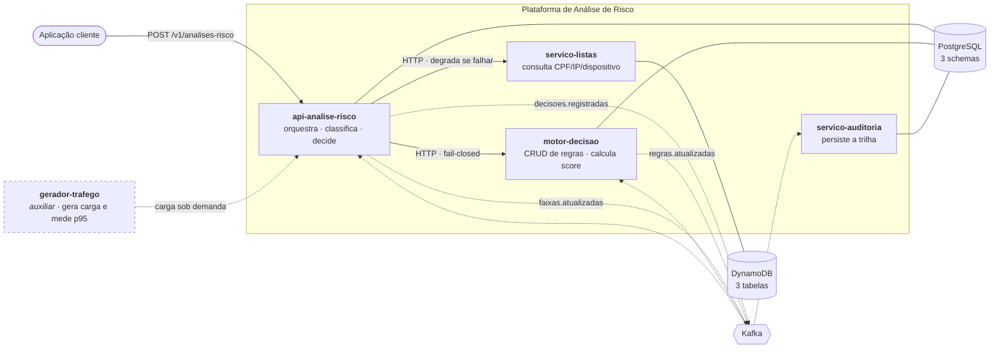
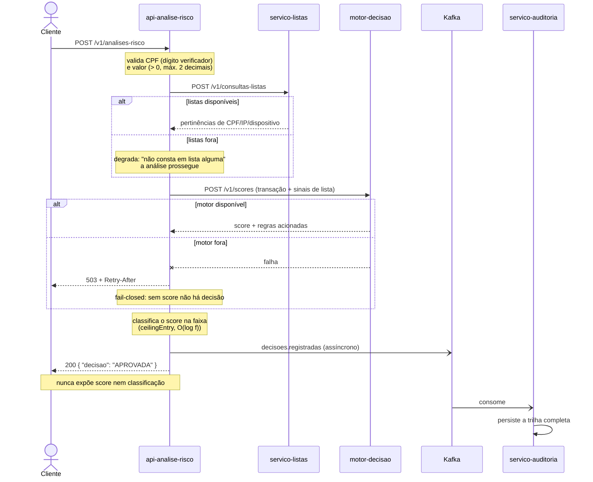

# Plataforma de Análise de Risco de Transações

Sistema distribuído que avalia o risco de transações financeiras e devolve uma decisão de
aprovação. Desafio técnico para Especialista em Prevenção a Fraudes.

**Stack**: Java 25 · Spring Boot 4.1 · Gradle · PostgreSQL · DynamoDB · Kafka (KRaft)

**Qualidade**: 349 testes · 94,3% de cobertura · gate de 90% que quebra o build

**Performance medida**: p95 de **129 ms** (JVM fria) e **78 ms** (aquecida), contra a meta de 150 ms —
1.500 requisições a 50 req/s, sem erros. Reproduzível pelo gerador de tráfego incluído.

---

## Índice

- [Como este projeto foi desenvolvido](#como-este-projeto-foi-desenvolvido)
- [Como executar](#como-executar)
- [Arquitetura](#arquitetura)
- [Fluxo da análise](#fluxo-da-análise)
- [O motor de decisão](#o-motor-de-decisão)
- [Endpoints](#endpoints)
- [Roteiro de testes](#roteiro-de-testes)
- [Análise assintótica](#análise-assintótica)
- [Decisões de arquitetura](#decisões-de-arquitetura)
- [Premissas assumidas](#premissas-assumidas)
- [Requisitos não funcionais](#requisitos-não-funcionais)

---

## Como este projeto foi desenvolvido

Este projeto foi construído com **desenvolvimento assistido por IA sob especificação prévia**
(spec-driven development), usando o [Spec Kit](https://github.com/github/spec-kit). Todo o processo
está versionado neste repositório e pode ser auditado — não é uma declaração, são artefatos.

### O fluxo, e o que cada etapa produziu

| Etapa | Artefato | Conteúdo |
|---|---|---|
| `constitution` | [`.specify/memory/constitution.md`](.specify/memory/constitution.md) | 7 princípios que restringem o que pode ser implementado |
| `specify` | [`spec.md`](specs/001-analise-risco-transacoes/spec.md) | 7 user stories, 46 requisitos funcionais, 12 critérios de sucesso |
| `clarify` | seção *Clarifications* na spec | 5 ambiguidades residuais resolvidas e registradas |
| `plan` | [`plan.md`](specs/001-analise-risco-transacoes/plan.md) · [`research.md`](specs/001-analise-risco-transacoes/research.md) · [`data-model.md`](specs/001-analise-risco-transacoes/data-model.md) · [`contracts/`](specs/001-analise-risco-transacoes/contracts/) | design, matriz de versões verificadas e contratos |
| `tasks` | [`tasks.md`](specs/001-analise-risco-transacoes/tasks.md) | 145 tarefas ordenadas por dependência |
| `analyze` | correções no `tasks.md` | consistência cruzada entre spec, plano e tarefas |
| `implement` | o código | execução das tarefas |

A **constitution** é a peça central e vale explicar: ela não descreve o sistema, ela **restringe** o
que pode ser feito. "O domínio MUST ser Java puro, sem anotação de framework." "O gate de 90% MUST
NOT ser reduzido nem contornado para viabilizar entrega." Cada plano subsequente passa por um
Constitution Check antes de virar código.

### Onde auditar

- [`docs/adr/`](docs/adr/) — 9 decisões arquiteturais, cada uma com alternativas e motivo da rejeição
- [`specs/001-analise-risco-transacoes/`](specs/001-analise-risco-transacoes/) — especificação
  funcional, plano técnico, modelo de dados, contratos e a matriz de versões verificadas
- [`.specify/memory/constitution.md`](.specify/memory/constitution.md) — os princípios que
  governaram a implementação
- [`docs/desafio.md`](docs/desafio.md) — o enunciado que originou a especificação

---

## Como executar

**Pré-requisitos**: Docker com Compose v2. JDK 25 apenas para rodar os testes localmente — o
wrapper do Gradle cuida do resto.

```bash
docker compose up -d --build
```

Sobe, na ordem de dependência: PostgreSQL, DynamoDB Local, Kafka em modo KRaft, os cinco serviços,
e um container efêmero que popula as listas com a massa dos cenários abaixo.

Aguardar readiness:

```bash
for p in 8080 8081 8082 8083; do
  curl -sf "http://localhost:$p/actuator/health" | grep -q UP && echo "porta $p OK"
done
```

| Serviço | Porta | Swagger |
|---|---|---|
| `api-analise-risco` | 8080 | http://localhost:8080/swagger-ui.html |
| `servico-listas` | 8081 | http://localhost:8081/swagger-ui.html |
| `motor-decisao` | 8082 | http://localhost:8082/swagger-ui.html |
| `servico-auditoria` | 8083 | http://localhost:8083/swagger-ui.html |
| `gerador-trafego` | 8084 | http://localhost:8084/swagger-ui.html |

O `gerador-trafego` é um serviço auxiliar: sobe **ocioso** e só gera tráfego quando recebe um
comando explícito. Veja o [cenário 12](#12--carga-e-medição-de-latência).

A chave administrativa de desenvolvimento é `chave-desenvolvimento`.

Para derrubar tudo e zerar os dados: `docker compose down -v`.

### Collection HTTP

`collection/` traz a collection do [Bruno](https://www.usebruno.com) com todos os endpoints dos cinco
serviços, o ambiente `local` já preenchido e asserções em cada requisição. Abra a pasta no Bruno ou
execute pela linha de comando:

```bash
npx @usebruno/cli run --env local -r      # a partir de collection/
```

### Testes

```bash
./gradlew clean build     # testes unitários + integração + gate de cobertura
```

Os testes de integração usam Testcontainers e exigem Docker rodando. A primeira execução baixa as
imagens de PostgreSQL, DynamoDB Local e Kafka.

```bash
./gradlew test --tests '*Test'   # apenas unitários, sem Docker
./gradlew test --tests '*IT'     # apenas integração
```

Relatórios de cobertura em `<módulo>/build/reports/jacoco/test/html/index.html`.

---

## Arquitetura



O `gerador-trafego` é auxiliar: não participa do fluxo de análise e sua ausência não afeta nenhum
requisito funcional. Existe para tornar a meta de latência verificável — ela só é afirmável se for
medida.

### O princípio que organiza a persistência

**A estratégia de acesso segue o perfil do dado.** Não há uma regra única:

| Dado | Volume | Padrão de acesso | Estratégia |
|---|---|---|---|
| **Listas** | milhões de entradas | lookup pontual por chave | DynamoDB, **sem cache local** |
| **Regras** | dezenas | leitura integral por transação | cache em memória + invalidação Kafka |
| **Faixas de score** | 3 linhas | leitura por transação | cache em memória + invalidação Kafka |

Cachear milhões de entradas de lista em cada réplica seria o erro: é dado grande com acesso esparso.
E ler dezenas de regras do banco a cada transação seria o outro erro: I/O no caminho crítico.

Consequência elegante: as listas **dispensam** mecanismo de recarga. O requisito de "recarregar as
listas quando atualizadas" é atendido por não haver cache stale — a escrita é imediatamente visível
a todas as réplicas.

### Camadas

Cada serviço tem três camadas, com dependências apontando para dentro:

```
dominio/           entidades, regras, invariantes — Java puro, zero framework
aplicacao/         casos de uso + portas (interfaces)
infraestrutura/    web, persistência, mensageria, clients HTTP
```

O `build.gradle` torna isso verificável: nenhuma dependência de framework alcança o pacote
`dominio`. É inspecionável, não apenas convencionado.

---

## Fluxo da análise



---

## O motor de decisão

É o núcleo técnico do desafio. Três mecanismos, cada um resolvendo um requisito específico.

### 1. Composição por chave de sobreposição

Toda regra declara uma **chave** que identifica o predicado avaliado. O conjunto efetivo de um tipo
de transação nasce da composição entre o conjunto `PADRAO` e o do tipo:

| Situação | Resultado |
|---|---|
| Mesma chave nos dois conjuntos | a específica **substitui** a padrão |
| Chave só no específico | é **acrescentada** |
| Chave só no padrão | **permanece ativa** |
| Regra sem chave | sempre **aditiva**, nunca substitui |

Complexidade: **O(P + E)** com `HashMap`.

Isso é observável pela API:

```bash
curl -s 'http://localhost:8082/v1/regras?tipoTransacao=CARTAO&efetivo=true' \
  -H 'X-Api-Key: chave-desenvolvimento' | jq '.regras[] | {chave, origem, pontos: .acao.pontos}'
```

```
faixa_valor_1                       origem=CARTAO   pontos=350   ← redefinida
faixa_valor_2                       origem=PADRAO   pontos=300   ← herdada
faixa_valor_3                       origem=PADRAO   pontos=400   ← herdada
faixa_valor_4                       origem=PADRAO   pontos=500   ← herdada
cpf_lista_permissiva                origem=CARTAO   pontos=400   ← redefinida
cpf_lista_restritiva                origem=PADRAO   pontos=400   ← herdada
ip_ou_dispositivo_lista_restritiva  origem=PADRAO   pontos=400   ← herdada
```

### 2. Duas naturezas de regra

O sistema distingue duas formas de pontuar, e a distinção é estrutural — uma regra não pode ser as
duas (a construção rejeita o híbrido com `422`).

**Escada** — faixas mutuamente exclusivas, das quais exatamente uma aplica:

```json
{
  "chave": "faixa_valor_1",
  "tipoTransacao": "PADRAO",
  "escada": "VALOR_TRANSACAO",
  "limiteSuperior": 300.00,
  "acao": { "tipo": "SOMAR", "pontos": 200 }
}
```

Declara **apenas o teto**. O piso é o teto da faixa anterior — o que torna lacuna e sobreposição
inexpressáveis, qualquer que seja a composição (ver [ADR 0002](docs/adr/0002-escada-por-limite-superior.md)).
Resolvida por `NavigableMap.ceilingEntry` em **O(log n)**.

**Condicional** — condições cumulativas combinadas por `E` ou `OU`:

```json
{
  "chave": "ip_ou_dispositivo_lista_restritiva",
  "tipoTransacao": "PADRAO",
  "operadorLogico": "OU",
  "condicoes": [
    { "campo": "IP_EM_LISTA_RESTRITIVA",          "operador": "IGUAL", "valor": "true" },
    { "campo": "DISPOSITIVO_EM_LISTA_RESTRITIVA", "operador": "IGUAL", "valor": "true" }
  ],
  "acao": { "tipo": "SOMAR", "pontos": 400 }
}
```

A regra `OU` aplica sua ação **uma única vez**, ainda que ambas as condições sejam verdadeiras. Isso
é garantido pela estrutura: o Composite reduz as condições a **um** booleano, e quem pontua consome
esse booleano — as condições individuais nunca chegam a quem soma.

### 3. Design patterns aplicados

| Pattern | Onde | Por quê |
|---|---|---|
| **Strategy** | `AvaliadorCondicao`, uma implementação por operador | operador novo é classe nova, sem tocar no avaliador |
| **Registry** | `Map<Operador, AvaliadorCondicao>` | dispatch **O(1)**; um `switch` concentraria a mudança |
| **Registry** | `Map<Campo, Function<Contexto, Object>>` | extração de campo sem reflexão |
| **Composite** | `AvaliadorRegra` | reduz N condições a um booleano; é o que garante o "uma vez" do `OU` |
| **Factory** | `Regra.deEscada` / `Regra.condicional` | construção nomeada por natureza, com invariante verificada |
| **ACL** | `ClienteListas`, `ClienteMotorDecisao` | traduz o modelo do vizinho; é onde vive a política de falha |

### Cálculo do score

```
soma = 0
para cada escada:            soma += faixa_resolvida.acao          # exatamente uma, O(log n)
para cada regra condicional: se acionada: soma += acao             # uma vez, não por condição

score = max(1, soma)                                               # piso aplicado UMA vez, ao final
```

O piso aplicado só no final importa: com regras que somam 100, subtraem 500 e somam 450, o resultado
é **50**. Se o piso fosse aplicado a cada passo, seria 451. Há teste nomeado para isso.

---

## Endpoints

### `POST /v1/analises-risco` — público

```json
{
  "cpf": "52998224725",
  "ip": "203.0.113.42",
  "idDispositivo": "3f2504e0-4f89-11d3-9a0c-0305e82c3301",
  "tipoTransacao": "PIX",
  "valorTransacao": 1500.00
}
```

**`200`** → `{ "decisao": "APROVADA" }` — e nada mais. Score e classificação não aparecem no corpo,
em header nem em mensagem de erro. Há teste que falha se aparecerem.

**`400`** → validação, em [RFC 9457](https://www.rfc-editor.org/rfc/rfc9457), com todos os campos
inválidos de uma vez.
**`503`** → fail-closed, com `Retry-After`.

### Administrativos — exigem `X-Api-Key`

| Método | Rota | Serviço |
|---|---|---|
| `GET` `PUT` | `/v1/faixas-score` | api-analise-risco |
| `GET` `POST` `PUT` `DELETE` | `/v1/regras` | motor-decisao |
| `GET` | `/v1/regras?tipoTransacao=X&efetivo=true` | motor-decisao |
| `PUT` | `/v1/listas` | servico-listas |
| `GET` | `/v1/trilhas?cpf=X` ou `?idCorrelacao=Y` | servico-auditoria |

### Internos — público intra-cluster

`POST /v1/consultas-listas` · `POST /v1/scores`

Todos os endpoints aceitam `X-Correlation-Id` e o devolvem na resposta. Se ausente, é gerado na
borda e propagado por todos os serviços.

---

## Roteiro de testes

Massa carregada pelo seed:

| Variável | Situação |
|---|---|
| CPF `11144477735` | lista restritiva |
| CPF `12345678909` | lista permissiva |
| CPF `00000000191` | **ambas** as listas |
| IP `198.51.100.66` | restritiva, válida |
| IP `198.51.100.77` | restritiva, **expirada** |
| Dispositivo `99999999-9999-4999-8999-999999999999` | restritiva |

### 1 · Aprovação

```bash
curl -s -X POST http://localhost:8080/v1/analises-risco -H 'Content-Type: application/json' \
  -d '{"cpf":"52998224725","ip":"198.51.100.10",
       "idDispositivo":"11111111-1111-4111-8111-111111111111",
       "tipoTransacao":"PIX","valorTransacao":150.00}'
```

→ `{"decisao":"APROVADA"}`. PIX até R$300 soma 300; nada em listas. Score 300 = BAIXO.

### 2 · Negativa por valor

Mesma chamada com `"valorTransacao":25000.00` → `{"decisao":"NEGADA"}`. PIX acima de R$20.000 soma
700 = ALTO.

### 3 · Regra `OU` aplicada uma única vez

```bash
curl -s -X POST http://localhost:8080/v1/analises-risco -H 'Content-Type: application/json' \
  -H 'X-Correlation-Id: teste-ou' \
  -d '{"cpf":"52998224725","ip":"198.51.100.66",
       "idDispositivo":"99999999-9999-4999-8999-999999999999",
       "tipoTransacao":"PIX","valorTransacao":150.00}'

curl -s 'http://localhost:8083/v1/trilhas?idCorrelacao=teste-ou' \
  -H 'X-Api-Key: chave-desenvolvimento' | jq '.[0] | {score, classificacao, regrasAcionadas}'
```

IP **e** dispositivo em lista restritiva. Score = **700** (300 + 400), não 1100. A regra `OU` somou
uma vez.

### 4 · IP expirado é tratado como ausente

Mesma chamada com `"ip":"198.51.100.77"` → `APROVADA`. A entrada existe no DynamoDB mas venceu; a
aplicação filtra na leitura.

### 5 · Herança por chave de sobreposição

```bash
curl -s 'http://localhost:8082/v1/regras?tipoTransacao=CARTAO&efetivo=true' \
  -H 'X-Api-Key: chave-desenvolvimento' | jq '.regras[] | {chave, origem}'
```

### 6 · Alterar regra sem restart

```bash
curl -s -X POST http://localhost:8082/v1/regras \
  -H 'Content-Type: application/json' -H 'X-Api-Key: chave-desenvolvimento' \
  -d '{"chave":"faixa_valor_2","tipoTransacao":"TED","descricao":"TED até R$5.000",
       "escada":"VALOR_TRANSACAO","limiteSuperior":5000.00,
       "acao":{"tipo":"SOMAR","pontos":800}}'

curl -s -X POST http://localhost:8080/v1/analises-risco -H 'Content-Type: application/json' \
  -d '{"cpf":"52998224725","ip":"198.51.100.10",
       "idDispositivo":"11111111-1111-4111-8111-111111111111",
       "tipoTransacao":"TED","valorTransacao":1000.00}'
```

Antes: `APROVADA` (herda 300 do padrão). Depois: `NEGADA` (800 = ALTO). Sem restart.

### 7 · Alterar a política de risco sem deploy

```bash
curl -s -X PUT http://localhost:8080/v1/faixas-score \
  -H 'Content-Type: application/json' -H 'X-Api-Key: chave-desenvolvimento' \
  -d '{"faixas":[{"classificacao":"BAIXO","limiteSuperior":399,"decisao":"APROVADA"},
                 {"classificacao":"MEDIO","limiteSuperior":699,"decisao":"NEGADA"},
                 {"classificacao":"ALTO","limiteSuperior":null,"decisao":"NEGADA"}]}'
```

Transações de risco médio passam a ser negadas.

### 8 · Degradação — listas fora

```bash
docker compose stop servico-listas
# repetir o cenário 1 → 200 APROVADA (a análise prossegue sem sinal de lista)
docker compose start servico-listas
```

### 9 · Fail-closed — motor fora

```bash
docker compose stop motor-decisao
# repetir o cenário 1 → 503 + Retry-After, NUNCA 200 NEGADA
docker compose start motor-decisao
```

### 10 · Validação acumulada

```bash
curl -s -X POST http://localhost:8080/v1/analises-risco -H 'Content-Type: application/json' \
  -d '{"cpf":"11111111111","ip":"198.51.100.10",
       "idDispositivo":"11111111-1111-4111-8111-111111111111",
       "tipoTransacao":"PIX","valorTransacao":0}'
```

`400` com **dois** erros. O CPF `11111111111` **satisfaz** o cálculo do dígito verificador do módulo
11 — validar só o algoritmo deixaria passar onze CPFs inválidos.

### 11 · Mascaramento em log, dado real na trilha

```bash
docker compose logs | grep -c '11144477735'   # → 0
curl -s 'http://localhost:8083/v1/trilhas?cpf=11144477735' \
  -H 'X-Api-Key: chave-desenvolvimento' | jq '.[0].cpf'   # → "11144477735"
```

Log e trilha têm públicos e controles de acesso diferentes.

### 12 · Carga e medição de latência

O serviço auxiliar gera tráfego sintético com CPFs válidos e distribuição calibrada, e mede a
latência do ponto de vista do cliente.

```bash
curl -s -X POST http://localhost:8084/v1/cargas \
  -H 'X-Api-Key: chave-desenvolvimento' -H 'Content-Type: application/json' \
  -d '{"duracaoSegundos":30,"requisicoesPorSegundo":50}'

# acompanhe ou consulte ao final
curl -s http://localhost:8084/v1/cargas/atual -H 'X-Api-Key: chave-desenvolvimento' | jq
```

Resultado medido nesta implementação, em 1.500 requisições:

| Execução | p50 | p95 | p99 | erros | meta 150 ms |
|---|---|---|---|---|---|
| Primeira (JVM fria) | 66 ms | **129 ms** | 614 ms | 0 | atingida |
| Segunda (JVM aquecida) | 48 ms | **78 ms** | 104 ms | 0 | atingida |

Três coisas que o relatório permite verificar:

- **`erro: 0`** — todo CPF gerado tem dígito verificador válido. Um gerador ingênuo receberia `400`
  em 100% das requisições e mediria a latência da validação, não da análise.
- **`decisoes` com aprovadas *e* negadas** (≈1.100 / ≈380) — prova de tráfego calibrado. Cem por
  cento de aprovação indicaria carga que não exercita a composição de regras.
- **A trilha cresce exatamente 1.500 registros** — o pipeline Kafka → auditoria sustentou a carga
  sem perder eventos:

```bash
docker compose exec -T postgres psql -U acme -d auditoria -c \
  "SELECT classificacao, decisao, COUNT(*) FROM trilha_decisao GROUP BY 1,2 ORDER BY 3 DESC;"
```

**Sobre o p99 da primeira execução**: 614 ms contra 104 ms na segunda. É aquecimento da JVM — JIT
compilando e caches preenchendo. O p95 fica abaixo da meta nas duas, mas vale registrar que a
primeira carga após a subida não é representativa do regime permanente.

Uma carga por vez: iniciar outra durante a execução devolve `409`, porque amostras misturadas
tornariam o percentil sem significado. Para interromper: `DELETE /v1/cargas/atual`.

---

## Análise assintótica

| Operação | Complexidade | Estrutura |
|---|---|---|
| Consulta das 3 variáveis nas listas | **O(1)** por item, 1 round-trip | `BatchGetItem` multi-tabela |
| Resolver faixa de valor | **O(log n)** | `NavigableMap.ceilingEntry` |
| Classificar score em faixa | **O(log f)** | `NavigableMap.ceilingEntry` |
| Compor conjunto efetivo | **O(P + E)** | `HashMap` por chave |
| Avaliar regras condicionais | **O(R × C)** | iteração com dispatch O(1) |
| Despachar operador | **O(1)** | `Map<Operador, Avaliador>` |
| Extrair valor de campo | **O(1)** | `Map<Campo, Function>` |
| Ler regras/faixas no caminho crítico | **O(1)** | cache em memória, zero I/O |
| Recarregar cache de regras | **O(P + E + n log n)** | leitura + construção das escadas |

`n` = faixas por escada · `f` = faixas de score · `R` = regras condicionais · `C` = condições por
regra · `P`/`E` = regras padrão e específicas.

**Onde a escolha de estrutura importou:** a resolução de faixa é a operação mais frequente do
sistema — uma por escada, por transação. `ceilingEntry` entrega O(log n) e a semântica de "primeira
faixa que cobre" de graça. Uma lista com varredura linear seria O(n) e exigiria manter a ordenação à
mão. A chave é `BigDecimal`, nunca `double`: a comparação ocorre em fronteira monetária, onde erro de
representação binária mudaria a faixa e portanto a pontuação.

---

## Decisões de arquitetura

Cada decisão relevante tem um ADR com o contexto, as alternativas consideradas e o motivo da
rejeição:

| ADR | Decisão |
|---|---|
| [0001](docs/adr/0001-topologia-quatro-servicos.md) | Topologia de quatro serviços |
| [0002](docs/adr/0002-escada-por-limite-superior.md) | Faixas declaradas apenas por limite superior |
| [0003](docs/adr/0003-conjunto-padrao-como-dado.md) | Conjunto padrão como dado, não código |
| [0004](docs/adr/0004-invalidacao-cache-por-kafka.md) | Invalidação de cache por evento Kafka |
| [0005](docs/adr/0005-dynamodb-tres-tabelas.md) | DynamoDB com três tabelas, não single-table |
| [0006](docs/adr/0006-degradacao-e-fail-closed.md) | Degradação nas listas, fail-closed no motor |
| [0007](docs/adr/0007-ubiquitous-language-portugues.md) | Ubiquitous Language em português |
| [0008](docs/adr/0008-sem-modulo-compartilhado.md) | Sem módulo compartilhado entre serviços |
| [0009](docs/adr/0009-gerador-trafego-como-modulo-java.md) | Gerador de tráfego como módulo Java, não ferramenta externa |

---

## Premissas assumidas

O enunciado tem pontos ambíguos e uma contradição. Cada premissa abaixo está documentada com sua
motivação.

**1 · O motor devolve o score; quem classifica é a API.**
A seção "Processamento" diz que o motor traduz o score em classificação; o passo 5 do fluxo diz que
o motor retorna apenas o score e a classificação vem depois. Adotei o passo 5 — é a descrição mais
explícita e mantém a política de risco fora do motor de cálculo. O motor acompanha o detalhamento
das regras acionadas, destinado à auditoria; a API **não** o propaga ao cliente.

**2 · Nomes padronizados em português.**
O enunciado alterna `op_type` e `tx_type` para o mesmo conceito, e mistura `snake_case` nos campos
de entrada com `camelCase` no exemplo de regras. Padronizei em português com case consistente por
camada (ver [ADR 0007](docs/adr/0007-ubiquitous-language-portugues.md)).

**3 · Valor monetário com no máximo duas casas decimais.**
Centavo é a menor unidade do real. Aceitar fração de centavo introduziria arredondamento silencioso
na comparação com os limites de faixa. Valor com três decimais é rejeitado com `400`.

**4 · Valor menor ou igual a zero é inválido.**
Nenhuma faixa do enunciado cobre zero, e produzir o score mínimo esconderia um erro de integração
do chamador.

**5 · Tipo de transação é texto livre, não enumeração.**
O enunciado escreve "PIX, CARTAO, TED, etc." — o "etc." é a pista. Enumeração fechada exigiria
deploy para cada tipo novo, contra o requisito de configuração dinâmica. Tipo desconhecido não é
erro: aplica-se apenas o conjunto `PADRAO`.

**6 · O CRUD de regras valida estrutura, não semântica.**
Campos obrigatórios e enums são verificados; a compatibilidade entre campo, operador e valor não.
`CPF_EM_LISTA_PERMISSIVA MAIOR_QUE 5` é aceito e nunca dispara. Uma decorrência disso exigiu
cuidado: `Boolean` implementa `Comparable` em Java, e `true.compareTo(false)` devolve `1` — sem
bloqueio explícito, essa regra sem sentido acionaria para **todo** CPF em lista permissiva. A
comparação ordinal sobre booleano é proibida no avaliador.

**7 · Chave de sobreposição única por tipo de transação.**
Duas regras de mesma chave no mesmo conjunto tornariam a composição indeterminada. Garantido por
constraint no banco; regras sem chave não entram na restrição.

**8 · CPF apenas com dígitos, com dígito verificador e sem sequências repetidas.**
Aceitar máscara criaria duas representações da mesma chave nas listas, com risco de um CPF
cadastrado com pontuação nunca casar na consulta.

**9 · Idempotência fora de escopo.**
Cada chamada é uma análise nova. O `X-Correlation-Id` oferece rastreabilidade, não deduplicação. Em
produção haveria `Idempotency-Key` com janela de retenção — relevante em pagamentos, onde retry é
comum.

**10 · Análise de risco sem autenticação.**
Assume-se chamada intra-cluster. Apenas as rotas administrativas exigem `X-Api-Key`. Em produção
haveria mTLS ou OAuth2 na malha de serviços.

**11 · Metas de desempenho.**
O enunciado pede baixa latência e alto volume sem números. Adotei 150 ms no percentil 95 para a
análise completa e propagação de configuração em até 5 s, por serem ordens de grandeza usuais em
autorização transacional.

**12 · Tabelas do DynamoDB criadas pela aplicação.**
Ativado por propriedade, para desenvolvimento e teste. Em produção seria IaC. O ganho é que o mesmo
caminho de criação serve o Compose e o Testcontainers, sem duplicar o schema.

**13 · Expurgo por TTL não é garantia.**
A AWS documenta que a remoção ocorre "within a few days" da expiração e recomenda filtrar itens
expirados na leitura. A aplicação filtra sempre — prática correta em produção, não contorno do
emulador.

---

## Requisitos não funcionais

**Performance.** Zero I/O de configuração no caminho crítico: regras e faixas vêm de cache em
memória. Consulta de listas em um round-trip. Resolução de faixa em O(log n). Timeouts explícitos
impedem que a latência de um vizinho se torne indisponibilidade própria.

**Medido, não estimado**: p95 de **129 ms** na JVM fria e **78 ms** aquecida, contra a meta de
150 ms — 1.500 requisições a 50 req/s, zero erros. Reproduza com o [cenário 12](#12--carga-e-medição-de-latência).

**Escalabilidade.** Serviços stateless, exceto pelos caches — que são reconstruíveis e invalidados
por evento com fan-out para todas as réplicas. Adicionar tipos de transação ou regras não requer
alteração de código. As listas escalam por partition key uniformemente distribuída.

**Manutenibilidade.** Domínio isolado de framework, verificável por inspeção do `build.gradle`.
Patterns aplicados onde resolvem um problema concreto, não por catálogo. Operador ou campo novo na
DSL custa uma classe e uma entrada de registro.

**Flexibilidade.** Nenhuma regra em código. Regras, faixas e política de decisão são dado, alterável
em runtime, com propagação em segundos.

**Confiabilidade.** Modo de falha declarado por dependência. Carga inválida de configuração preserva
o estado anterior — nunca se serve cache vazio ou parcial. Invariantes verificadas na carga, não no
caminho da transação. Idempotência no consumo da trilha por constraint de unicidade.

**Testabilidade.** 349 testes, 94,3% de cobertura, gate de 90% que quebra o build — aplicado aos
cinco módulos, sem exclusão de módulo. O domínio é testável sem Spring, sem banco e sem rede. Cada
regra do enunciado tem teste nomeado: composição por chave, piso do score aplicado uma vez, `OU`
disparando uma vez, múltiplas escadas independentes, degradação, fail-closed, mascaramento em log e
a garantia de que score nunca vaza na resposta.

### O que faria diferente com mais tempo

- **Circuit breaker** nos clients HTTP. Hoje há timeout, que resolve o caso individual; sob falha
  sustentada, um breaker evitaria gastar o orçamento de latência em toda requisição.
- **Métricas de negócio** no Micrometer: taxa de negação por faixa, quanto risco a degradação de
  listas gerou, latência por dependência.
- **Autorização por papel** nas rotas administrativas: hoje uma única chave dá acesso a tudo,
  inclusive a remover todas as regras.
