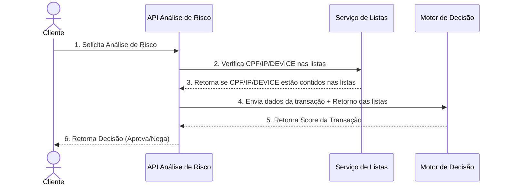

# Desafio Técnico — Especialista em Prevenção a Fraudes

---

## Cenário

O Banco ACME está conduzindo a modernização de sua plataforma legada, adotando uma arquitetura distribuída baseada em
microsserviços.

Nesta fase inicial do projeto, será desenvolvido um novo serviço responsável pela avaliação de risco de transações
financeiras, exposto por meio de uma API REST.

---

## Objetivo

Projetar e implementar um sistema distribuído baseado em HTTP REST, responsável por realizar a análise de risco de um
tipo específico de operação financeira.

O sistema deve ser construído com foco em modularidade e aderência a boas práticas de arquitetura de microsserviços -
MSA.

### Escopo da Entrega Inicial

Nesta primeira fase, o sistema deverá contemplar as seguintes funcionalidades principais:

1. **Orquestração do Pedido de Análise de Risco**
   Responsável por coordenar os componentes envolvidos na avaliação de risco, assegurando o fluxo adequado de dados e
   decisões entre os módulos do sistema.

2. **Listas Restritivas e Permissivas (Allow e Deny Lists)**
   Módulo encarregado de verificar se a operação ou o cliente está presente em listas de bloqueio ou permissão,
   impactando diretamente a decisão de risco.

3. **Motor de Decisão**
   Componente que aplica as regras de negócio definidas para classificar o risco da operação, com base em critérios como
   valor da transação, variáveis contidas em listas, entre outros parâmetros relevantes.

O diagrama abaixo ilustra o ecossistema e a sequência macro do processo descrito anteriormente:



Atributos que cada componente manipula no fluxo:

| Componente               | Atributos                                                                        |
|--------------------------|----------------------------------------------------------------------------------|
| **Cliente** (Ator)       | —                                                                                |
| **API Análise de Risco** | `cpf: string`, `ip: string`, `op_type: string`, `device_id: UUID`                |
| **Serviço de Listas**    | `permissive: boolean`, `restrictive: boolean`, `status: string`, `list_id: UUID` |
| **Motor de Decisão**     | `cpf: string`, `op_type: string`, `value: string`, `list_result: string`         |

### Passos do Fluxo da Requisição

1. **Cliente → API de Análise de Risco**
   O cliente envia uma requisição HTTP REST contendo os dados da transação: `CPF`, `IP`, `device_id`, `tipo` e `valor`.
   Essa requisição inicia o processo de avaliação de risco.

2. **API de Análise de Risco → Serviço de Listas**
   A API consulta o serviço de listas para verificar se o `CPF`, `IP` ou `device_id` estão presentes em listas
   permissivas ou restritivas. Essa verificação influencia diretamente o cálculo do risco.

3. **Serviço de Listas → API de Análise de Risco**
   O serviço de listas retorna se cada variável consultada está ou não contida nas listas permissivas ou restritivas.

4. **API de Análise de Risco → Motor de Decisão**
   Com os dados da transação e os resultados das listas, a API envia essas informações ao motor de decisão para que ele
   aplique as regras de negócio configuradas.

5. **Motor de Decisão → API de Análise de Risco**
   O motor de decisão processa todas as regras aplicáveis e retorna apenas o score numérico da transação. A
   classificação de risco (baixo, médio, alto) é processada posteriormente pela API de análise de risco com base nesse
   score.

6. **API de Análise de Risco → Cliente**
   A API interpreta o score recebido e retorna ao cliente a decisão final da análise: Aprovado ou Negado, sem expor o
   score ou a classificação diretamente.

> **Atenção:** O diagrama acima representa exclusivamente a comunicação entre os domínios funcionais do sistema. **Ele
não reflete a arquitetura técnica** nem define a divisão de serviços ou microsserviços a serem adotados. Como parte do
> desafio, espera-se que os participantes modelem os componentes arquiteturais da forma mais adequada para atender aos
> requisitos do problema.

---

## Requisitos Funcionais

### Funcionalidade de Pedido de Análise de Risco

1. Desenvolva um serviço HTTP REST que receba solicitações de avaliação de risco de aplicações cliente, orquestre
   chamadas a serviços internos e retorne uma decisão de avaliação da transação. Aprovado ou Negado.

2. O serviço de análise de risco deve permitir a configuração dinâmica dos intervalos de score utilizados para
   determinar a classificação de risco. Essa configuração deve ser externa ao código-fonte, podendo ser realizada por
   meio de:

    - Arquivo de configuração (ex: JSON, YAML)
    - Banco de dados
    - Endpoint administrativo

   Nas seções seguintes serão apresentados os valores padrão dos intervalos de score, que poderão ser ajustados conforme
   necessidade.

### Fluxo operacional da funcionalidade de Análise de Risco

A funcionalidade deve ser capaz de receber transações e orquestrar a avaliação de risco de forma eficiente, seguindo as
etapas descritas abaixo:

#### Requisição (Input)

A seguir, apresentamos uma tabela com os campos e suas descrições para o input de dados, facilitando a visualização e
entendimento do fluxo:

| Campo     | Tipo    | Descrição                                              |
|-----------|---------|--------------------------------------------------------|
| cpf       | string  | CPF do cliente, apenas números                         |
| ip        | string  | Identificador do endereço IP do dispositivo do cliente |
| device_id | uuid    | Identificador único do dispositivo                     |
| tx_type   | string  | Tipo da transação: PIX, CARTAO, TED, etc.              |
| tx_value  | decimal | Valor monetário da transação                           |

#### Processamento

1. O serviço de listas deve ser consultado para identificar se o CPF, IP ou DeviceID do cliente está presente em listas
   permissivas ou restritivas. Um mesmo CPF pode estar em ambas, enquanto IP e DeviceID aparecem apenas em listas
   restritivas. Também é possível que nenhum dado esteja em qualquer lista. As informações obtidas serão posteriormente
   enviadas ao motor de decisão.

2. Consultar o serviço de Motor de Decisão para obter o score da transação:

    - Este serviço retorna um score de risco representado por um valor numérico inteiro.
    - Para evitar a exposição do score completo e reduzir a complexidade, o serviço traduz o intervalo do score em
      classificações de risco, conforme abaixo:

        - **Risco Baixo:** score entre 1 e 399
        - **Risco Médio:** score entre 400 e 699
        - **Risco Alto:** score a partir de 700 (x ∈ Z | x ≥ 700)

    - O resultado da avaliação segue a seguinte lógica inicialmente:
        - Para risco baixo e risco médio: aprovar a transação
        - Para risco alto: negar a transação

#### Resposta (Output)

A seguir, apresentamos uma tabela com os campos e suas descrições para o output de dados, facilitando a visualização e
entendimento do fluxo:

| Campo       | Tipo   | Descrição                                                                           |
|-------------|--------|-------------------------------------------------------------------------------------|
| tx_decision | string | Indica o resultado da avaliação da transação. Valores possíveis: Aprovada ou Negada |

---

### Funcionalidade de Listas Permissivas e Restritivas

1. Desenvolver um serviço HTTP REST capaz de verificar se determinadas variáveis estão presentes em listas permissivas
   ou restritivas, retornando de forma clara se cada variável consultada está contida em uma dessas listas, em ambas ou
   em nenhuma delas.

2. Não é necessária a implementação de um CRUD completo para as listas e os dados nelas contidos. No entanto, o serviço
   deve ser capaz de recarregar essas listas sempre que forem atualizadas, garantindo que o processamento utilize sempre
   as informações mais recentes.

### Fluxo operacional da funcionalidade de Listas

A funcionalidade deve retornar se uma ou mais variáveis estão presentes em listas permissivas ou restritivas, ou se não
pertencem a nenhuma delas. Esse resultado será consumido pelo motor de execução de regras que poderá utilizar essa
informação como um dos fatores para compor o score de risco da transação.

#### Requisição (Input)

A seguir, apresentamos uma tabela com os possíveis campos e suas descrições para o input de dados, facilitando a
visualização e entendimento do fluxo:

| Campo     | Tipo   | Descrição                           |
|-----------|--------|-------------------------------------|
| cpf       | string | CPF do cliente, apenas números.     |
| ip        | string | Endereço IP do cliente.             |
| device_id | uuid   | Identificador único do dispositivo. |

1. **Regras para verificação do enquadramento de variáveis em listas:**

    - O CPF pode estar contido em listas permissivas.
    - O CPF pode estar contido em listas restritivas.
    - O CPF pode estar contido tanto em listas permissivas quanto restritivas.
    - O IP e DeviceID do cliente, podem estar em listas restritivas.
    - O CPF, o IP e o DeviceID podem não estar em nenhuma das listas.

2. **As listas podem ser armazenadas em diferentes formatos** dependendo da estratégia de persistência e desempenho
   adotada pelo sistema, como por exemplo:

    - Arquivos.
    - Banco de Dados (SQL, NoSQL).
    - Mecanismos de Cache.
    - etc

   A decisão sobre a forma de armazenamento das listas é totalmente flexível, ficando a critério do (a) candidato (a)
   escolher a abordagem que considerar mais adequada.

#### Resposta (Output)

A definição dos contratos de requisição e resposta, a quantidade de listas utilizadas e a forma de verificação das
variáveis (se estão ou não contidas nas listas) ficam sob total responsabilidade do (a) candidato (a), que poderá adotar
a abordagem que considerar mais adequada à solução proposta.

---

### Funcionalidades do Motor de Decisão

1. Uma **regra de decisão** é uma instrução lógica que define o que deve acontecer quando certas condições são
   atendidas. Ela é composta por:

    - **Condições:** critérios que precisam ser verdadeiros (ex: valor da transação maior que x, CPF contido em lista
      restritiva, etc.).
    - **Operador lógico:** define como as condições de uma mesma regra se combinam. Aceita `E` e `OU`. Quando omitido,
      assume-se `E`.
    - **Ação:** o que deve ser feito quando as condições são satisfeitas (ex: somar ou subtrair pontos de score).

2. O serviço deve ser capaz de realizar as operações de consulta, inclusão, atualização e exclusão das regras que serão
   processadas pelo motor de decisão. Esse serviço deve permitir o gerenciamento completo das regras, possibilitando que
   sejam criadas, modificadas, removidas ou recuperadas conforme necessário para garantir flexibilidade e controle sobre
   o comportamento do motor.

3. A definição dos contratos de requisição e resposta, a forma de armazenamento e execução das regras ficam sob total
   responsabilidade do (a) candidato (a), que poderá adotar a abordagem que considerar mais adequada à solução proposta.

### Fluxo operacional da funcionalidade de Motor de Decisão

Desenvolva uma funcionalidade que calcule o score de risco de uma transação financeira com base em regras de decisão.
Cada regra possui condições (como valor da transação, tipo, presença em listas restritivas ou permissivas) e uma ação
(somar ou subtrair pontos). A aplicação deve processar os dados da transação, aplicar as regras compatíveis e retornar o
score final, refletindo o risco envolvido.

#### Requisição (Input)

A seguir, apresentamos uma tabela com os possíveis campos e suas descrições para o input de dados, facilitando a
visualização e entendimento do fluxo:

| Campo                                 | Tipo    | Descrição                                            |
|---------------------------------------|---------|------------------------------------------------------|
| cpf                                   | string  | CPF do cliente, apenas números.                      |
| ip                                    | string  | Endereço IP do cliente.                              |
| device_id                             | uuid    | Identificador único do dispositivo.                  |
| tx_type                               | string  | Tipo da transação: PIX, CARTAO, TED, etc.            |
| tx_value                              | decimal | Valor monetário da transação                         |
| inPermissiveList ou inRestrictiveList | boolean | Indica se a variável está presente em uma das listas |

1. As regras devem ser **dinâmicas** e **interpretáveis** em tempo de execução, permitindo que sejam incluídas,
   alteradas ou removidas sem a necessidade de realizar um novo deploy da aplicação. Isso garante flexibilidade para que
   usuários de negócio possam gerenciar as regras diretamente, conforme a evolução das necessidades do sistema.

2. As regras poderão ser armazenadas em diferentes formatos dependendo da estratégia de persistência e desempenho
   adotada pelo sistema, como por exemplo:

    - Arquivos.
    - Banco de Dados (SQL, NoSQL).
    - Mecanismos de Cache.

3. O score de risco calculado deverá ser qualquer inteiro maior que zero {x ∈ Z | x > 0}. Como o cálculo é cumulativo e
   admite subtrações, o score final corresponde ao maior valor entre `1` e a soma acumulada. O piso é aplicado uma única
   vez, ao final da avaliação de todas as regras, nunca a resultados intermediários.

4. O score final de risco é calculado de forma cumulativa, a partir da soma ou subtração de pontos definidos nas ações
   das regras cujas condições forem atendidas.

5. Todas as regras precisam ser processadas para que o score final seja computado.

6. O conjunto de regras deve ser específico para cada tipo de transação. Por exemplo, transações do tipo PIX podem ter
   regras com atributos diferentes das regras aplicadas a transações do tipo Cartão. Isso permite personalizar a lógica
   de decisão conforme o contexto da operação.

7. Para facilitar a modelagem e reutilização de regras, o sistema pode contar com um conjunto de regras padrão
   (default), aplicável a todos os tipos de transações.

   **Exemplo:**

    - 4 regras default aplicáveis a qualquer tipo de transação;
    - Regras adicionais específicas por tipo (ex: 2 regras extras ou com valores diferentes para transações do tipo
      Cartão).

8. Toda regra declara uma **chave de sobreposição**, que identifica o predicado que ela avalia. A chave é o que permite
   compor os dois conjuntos de regras:

    - Parte-se do conjunto de regras padrão.
    - Para cada regra específica do tipo de transação, se existir regra padrão com a mesma chave, a específica
      **substitui** a padrão; caso contrário, a específica é **acrescentada**.
    - Regras padrão sem correspondente específico **permanecem ativas**.

   Regras sem chave declarada são sempre aditivas e nunca substituem outra regra.

### Exemplo de Lógica Aplicada ao Motor de Decisão

Durante o **startup da aplicação**, o sistema deve carregar um conjunto de regras padrão (default) aplicáveis a todos os
tipos de transações. Essas regras são:

- **Faixa de valor da transação:**

  | Chave           | Intervalo                   | Ação                     | 
  |-----------------|-----------------------------|--------------------------|
  | `faixa_valor_1` | de R$0,01 a R$300,00        | soma 200 pontos ao score |
  | `faixa_valor_2` | de R$300,01 a R$5.000,00    | soma 300 pontos          |
  | `faixa_valor_3` | de R$5.000,01 a R$20.000,00 | soma 400 pontos          |
  | `faixa_valor_4` | acima de R$20.000,00        | soma 500 pontos          |

  As faixas são contíguas e mutuamente exclusivas: toda transação de valor positivo se enquadra em exatamente uma delas.

- **Listas de verificação:**

  | Chave                           | Condição                                  | Ação               |
  |---------------------------------|-------------------------------------------|--------------------|
  | `cpf_lista_permissiva`          | CPF na lista permissiva                   | subtrai 200 pontos |
  | `cpf_lista_restritiva`          | CPF na lista restritiva                   | soma 400 pontos    |
  | `ip_ou_device_lista_restritiva` | IP **ou** dispositivo na lista restritiva | soma 400 pontos    |

  A última regra usa operador `OU` e aplica sua ação uma única vez, ainda que IP e dispositivo estejam ambos em lista
  restritiva.

### Regras Dinâmicas por Tipo de Transação

O sistema deve permitir a **configuração dinâmica** de regras específicas para cada tipo de transação, que se compõem
com as regras padrão pelo mecanismo de chave de sobreposição descrito acima.

**Exemplos:**

- Para transações do tipo CARTÃO:

    - Valor entre R$0,01 e R$300,00 → soma 300 pontos ao invés de 200 (mesma chave `faixa_valor_1`, valor substituído).
    - CPF na lista permissiva → subtrai 300 pontos ao invés de 200 (mesma chave `cpf_lista_permissiva`).
    - As faixas `faixa_valor_2`, `faixa_valor_3` e `faixa_valor_4`, sem correspondente específico, permanecem valendo
      com os valores do conjunto padrão.

Esses exemplos ilustram que a lógica do motor de decisão deve ser flexível e parametrizável, permitindo:

- A substituição ou extensão das regras padrão por regras específicas de tipo.
- A atualização das regras em tempo de execução, sem necessidade de reiniciar a aplicação.
- A coexistência de regras padrão (default) com regras customizadas por tipo de transação, garantindo cobertura ampla e
  adaptabilidade.

### Exemplo de estrutura das regras em JSON

O exemplo abaixo declara apenas o conjunto **específico por tipo de transação**. Ele coexiste com o conjunto padrão
descrito na seção anterior e se compõe com ele pela chave de sobreposição — não o substitui integralmente. Note que
`PIX` redefine todas as chaves, enquanto `CARTAO` e `TED` redefinem apenas algumas e herdam o restante do conjunto
padrão.

```json
{
  "regrasPorTipoTransacao": {
    "PIX": [
      {
        "id": "pix_valor_ate_300",
        "chave": "faixa_valor_1",
        "condicoes": {
          "valorMinimo": 0.01,
          "valorMaximo": 300.0
        },
        "acao": {
          "tipo": "SOMAR",
          "valor": 300
        }
      },
      {
        "id": "pix_valor_301_a_5000",
        "chave": "faixa_valor_2",
        "condicoes": {
          "valorMinimo": 300.01,
          "valorMaximo": 5000.0
        },
        "acao": {
          "tipo": "SOMAR",
          "valor": 400
        }
      },
      {
        "id": "pix_valor_5001_a_20000",
        "chave": "faixa_valor_3",
        "condicoes": {
          "valorMinimo": 5000.01,
          "valorMaximo": 20000.0
        },
        "acao": {
          "tipo": "SOMAR",
          "valor": 430
        }
      },
      {
        "id": "pix_valor_acima_20000",
        "chave": "faixa_valor_4",
        "condicoes": {
          "valorMinimo": 20000.01
        },
        "acao": {
          "tipo": "SOMAR",
          "valor": 700
        }
      },
      {
        "id": "pix_cpf_lista_permissiva",
        "chave": "cpf_lista_permissiva",
        "condicoes": {
          "cpfEmListaPermissiva": true
        },
        "acao": {
          "tipo": "SUBTRAIR",
          "valor": 100
        }
      },
      {
        "id": "pix_cpf_lista_restritiva",
        "chave": "cpf_lista_restritiva",
        "condicoes": {
          "cpfEmListaRestritiva": true
        },
        "acao": {
          "tipo": "SOMAR",
          "valor": 200
        }
      },
      {
        "id": "pix_ip_ou_device_lista_restritiva",
        "chave": "ip_ou_device_lista_restritiva",
        "operador": "OU",
        "condicoes": {
          "ipEmListaRestritiva": true,
          "deviceEmListaRestritiva": true
        },
        "acao": {
          "tipo": "SOMAR",
          "valor": 400
        }
      }
    ],
    "CARTAO": [
      {
        "id": "cartao_valor_ate_300",
        "chave": "faixa_valor_1",
        "condicoes": {
          "valorMinimo": 0.01,
          "valorMaximo": 300.0
        },
        "acao": {
          "tipo": "SOMAR",
          "valor": 350
        }
      },
      {
        "id": "cartao_cpf_lista_permissiva",
        "chave": "cpf_lista_permissiva",
        "condicoes": {
          "cpfEmListaPermissiva": true
        },
        "acao": {
          "tipo": "SUBTRAIR",
          "valor": 400
        }
      }
    ],
    "TED": [
      {
        "id": "ted_valor_ate_300",
        "chave": "faixa_valor_1",
        "condicoes": {
          "valorMinimo": 0.01,
          "valorMaximo": 300.0
        },
        "acao": {
          "tipo": "SOMAR",
          "valor": 280
        }
      },
      {
        "id": "ted_valor_acima_20000",
        "chave": "faixa_valor_4",
        "condicoes": {
          "valorMinimo": 20000.01
        },
        "acao": {
          "tipo": "SOMAR",
          "valor": 750
        }
      }
    ]
  }
}
```

> **Atenção:** O exemplo acima representa apenas uma forma não exaustiva de como as regras poderiam ser estruturadas em
> formato JSON. Fica a critério do (a) candidato (a) modelar, estruturar e armazenar as regras da forma que considerar
> mais adequada, desde que atenda aos requisitos de flexibilidade e clareza na definição das condições e ações do motor
> de
> decisão.

---

## Requisitos Não Funcionais

### Requisitos Não Funcionais Prioritários para Avaliação!

1. **Performance**
    - O sistema deve processar regras e calcular o score de risco com baixa latência, mesmo com grandes volumes de
      transações.

2. **Escalabilidade**
    - A arquitetura deve permitir o crescimento do número de regras, tipos de transações e volume de dados sem perda
      significativa de desempenho.

3. **Manutenibilidade**
    - O código deve ser modular, legível e de fácil manutenção, permitindo ajustes e inclusão de novas regras de negócio
      com o mínimo de impacto.

4. **Flexibilidade e Configurabilidade**
    - As funcionalidades devem ser facilmente configuráveis (por exemplo, via arquivos JSON, banco de dados ou interface
      administrativa).

5. **Confiabilidade**
    - O sistema deve garantir consistência no cálculo do score, mesmo em cenários de falhas parciais ou dados
      incompletos.

6. **Testabilidade**
    - A lógica de decisão deve ser testável de forma isolada, com cobertura de testes unitários e testes de integração
      para diferentes cenários.

### Por que avaliamos requisitos não funcionais em um desafio com aplicação simples?

Mesmo sendo uma aplicação simples e voltada apenas para fins de teste, avaliamos os requisitos não funcionais para
entender como o (a) candidato (a) pensa sobre aspectos críticos de **qualidade de software**. Nosso objetivo é analisar
se a arquitetura e o código propostos seriam capazes de evoluir para um ambiente produtivo, caso essa aplicação fosse
escalada.

Queremos observar, por exemplo:

- Se a solução suportaria um alto volume de transações por segundo (TPS);
- Como ela se comportaria diante de falhas em serviços ou microsserviços;
- Se há preocupação com resiliência, escalabilidade e desempenho.

Essa análise nos ajuda a simular um cenário real de evolução do sistema e identificar se a solução proposta foi pensada
com visão de longo prazo e boas práticas de engenharia de software.

---

## Orientações Gerais

- **Crie um arquivo `docker-compose.yml`** contendo toda a infraestrutura necessária para executar o desafio.

  **Exemplo:**

    - Banco de dados
    - Broker de mensageria
    - Mock server
    - Sua aplicação principal

- **No arquivo `README.md`, documente de forma clara e objetiva:**

    - O método escolhido para interação com o sistema (ex: API REST, etc.).
    - Como executar o sistema (ex: comandos para subir as aplicações).
    - Como testar o sistema (ex: endpoints, dados de exemplo, ferramentas recomendadas).
    - Qualquer outra informação relevante que facilite o entendimento e uso do projeto
    - Detalhes sobre a solução, gostaríamos de saber qual foi o seu racional nas decisões.
    - Caso algo não esteja claro e você precisou assumir alguma premissa quais foram e o que te motivou a tomar essas
      decisões.

---

## Linguagem de Programação

Dê preferência a uma linguagem consolidada no mercado — as mais utilizadas em prevenção a fraudes são **Java** e
**Python**. No entanto, sinta-se à vontade para utilizar a linguagem com a qual você tem mais familiaridade.

Nosso foco está em avaliar a qualidade da solução, e não restringir a escolha da linguagem!

---

## Modelagem dos Endpoints

Espera-se que os participantes realizem a modelagem completa dos endpoints das APIs, incluindo:

- Definição das rotas (URLs)
- Estrutura dos headers
- Formato do body das requisições e respostas
- Utilização adequada dos códigos de status HTTP

Os campos de input e output apresentados neste documento têm caráter **exemplificativo** e representam os principais
fluxos esperados. Os participantes têm liberdade para utilizá-los conforme estão descritos ou adaptá-los de acordo com
suas decisões de projeto, desde que respeitem os objetivos funcionais propostos.

---

## Pontos que daremos mais atenção

Abaixo os pontos que daremos mais atenção na avaliação do desafio:

- Arquitetura utilizada
- Abstração, acoplamento, extensibilidade e coesão
- Análise assintótica, utilizando a notação Big O
- Design Patterns (Ex: Singleton, Strategy, Factory, etc.)
- Microservices Patterns (Ex: CQRS, SAGA, ACL, etc.)
- Clean Architecture
- Clean Code
- SOLID
- Testes de unidade e integração
- Cobertura de testes (Code Coverage)
- Documentação da Solução no README.md

---

## Pontos que não iremos avaliar

Neste desafio, a avaliação estará focada no código-fonte e na interação entre os componentes da arquitetura da
aplicação.

**Importante:** Aspectos relacionados à **infraestrutura** do desafio não serão avaliados neste momento.

⚠️ É possível que alguns arquivos adicionais sejam necessários para executar ou testar o desafio. No entanto, eles não
serão avaliados. Portanto, implemente apenas o que for necessário para garantir o funcionamento e a testabilidade do
projeto.

**Itens que não serão avaliados:**

- Qualquer ponto relacionado à **infraestrutura**
- Orquestração de containers
- Tunning de Database
- **Dockerfile**
- Scripts **CI/CD**
- **Terraform**
- **Collections** de ferramentas como Postman, Insomnia ou similares

---

## Como esperamos receber sua solução

- Esta etapa é eliminatória, e por isso esperamos que o código reflita essa importância.
- Enviar o desafio em formato .zip
